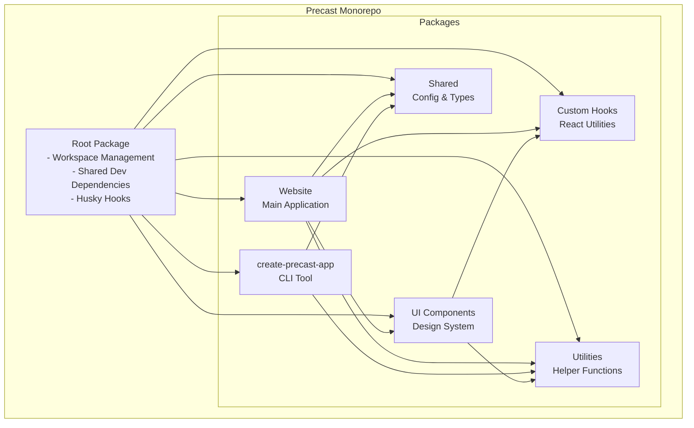
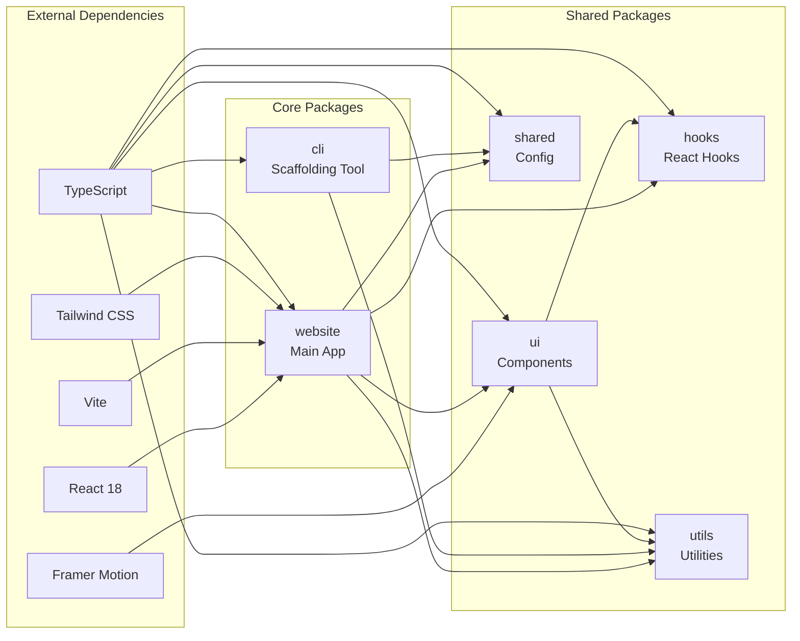
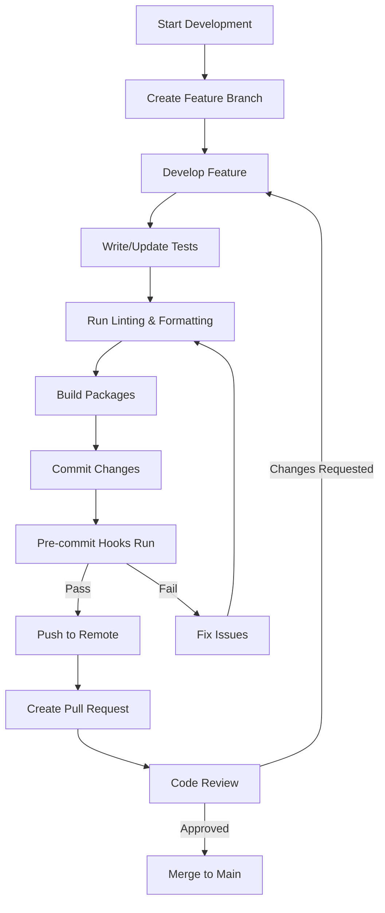
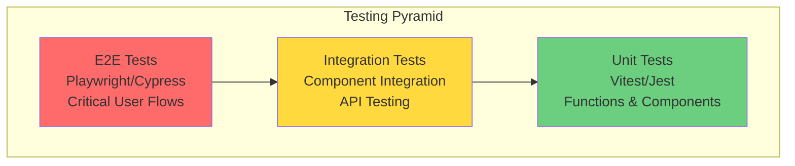
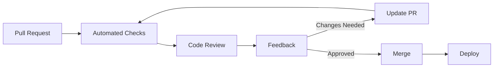
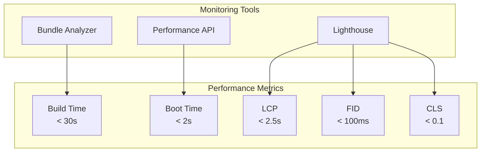

# Contributing to Precast App

Welcome to the Precast App monorepo! This guide will help you understand our project structure, development workflow, and contribution process.

## Table of Contents

- [Monorepo Architecture](#monorepo-architecture)
- [Project Structure](#project-structure)
- [Development Requirements](#development-requirements)
- [Getting Started](#getting-started)
- [Package Overview](#package-overview)
- [Development Workflow](#development-workflow)
- [Code Quality Standards](#code-quality-standards)
- [Testing Strategy](#testing-strategy)
- [Contributing Guidelines](#contributing-guidelines)
- [Pull Request Process](#pull-request-process)
- [Communication](#communication)

## Monorepo Architecture

Our project uses a monorepo structure managed with pnpm workspaces. This allows us to share code efficiently while maintaining clear boundaries between packages.



## Project Structure

```
precast-app/
├── .github/                 # GitHub Actions workflows
│   └── workflows/
│       ├── update-analytics.yml  # GA4 data fetching
│       └── ci.yml               # CI/CD pipeline
├── .husky/                  # Git hooks
│   ├── pre-commit          # Code quality checks
│   └── install.mjs         # Husky setup script
├── packages/                # Monorepo packages
│   ├── cli/                # CLI tool package
│   │   ├── src/
│   │   │   ├── commands/   # CLI commands
│   │   │   ├── generators/ # Framework generators
│   │   │   ├── templates/  # Project templates
│   │   │   └── utils/      # CLI utilities
│   │   ├── docs/           # CLI documentation
│   │   └── dist/           # Built CLI output
│   ├── website/            # Main website
│   │   ├── src/
│   │   │   ├── components/ # React components
│   │   │   ├── pages/      # Page components
│   │   │   ├── hooks/      # Custom hooks
│   │   │   └── features/   # Feature modules
│   │   └── public/         # Static assets
│   ├── ui/                 # Shared UI library
│   │   └── src/
│   │       └── components/ # Atomic design components
│   ├── hooks/              # Shared React hooks
│   ├── utils/              # Shared utilities
│   └── shared/             # Shared config & types
├── scripts/                # Build & maintenance scripts
├── data/                   # Analytics data (auto-generated)
├── package.json            # Root package configuration
├── pnpm-workspace.yaml     # Workspace configuration
└── tsconfig.json           # TypeScript config
```

## Development Requirements

### Prerequisites

- **Node.js**: v18.0.0 or higher
- **Package Manager**: Bun (preferred) or pnpm v8.0.0+
- **Git**: v2.34.0 or higher
- **Operating System**: macOS, Linux, or Windows with WSL2

### Recommended Tools

- **IDE**: VS Code with recommended extensions
- **Terminal**: Modern terminal with Unicode support
- **Browser**: Chrome/Firefox/Safari (latest versions)

### VS Code Extensions

Create `.vscode/extensions.json`:

```json
{
  "recommendations": [
    "dbaeumer.vscode-eslint",
    "esbenp.prettier-vscode",
    "bradlc.vscode-tailwindcss",
    "dsznajder.es7-react-js-snippets",
    "streetsidesoftware.code-spell-checker"
  ]
}
```

## Getting Started

### 1. Quick Setup with Make

The easiest way to get started is using our Makefile:

```bash
# Clone the repository
git clone https://github.com/BuunGroupCore/precast-app.git
cd precast-app

# Complete environment setup (installs deps, configures git hooks, builds packages)
make setup

# Or if you prefer manual setup:
bun install
node .husky/install.mjs
bun run build
```

### Available Make Commands

```bash
make help          # Show all available commands
make setup         # Complete environment setup
make dev           # Start development server
make test          # Run all tests
make doctor        # Diagnose common issues
make ci            # Run all CI checks locally
```

### 2. Development Commands

```bash
# Start website development server
bun dev

# Run CLI locally
./packages/cli/dist/cli.js init test-project

# Run tests
bun test

# Type checking
bun typecheck

# Linting
bun lint

# Format code
bun format
```

## Package Overview

### Package Dependency Graph



### Package Responsibilities

#### `@precast/cli` - CLI Tool
- **Purpose**: Scaffold new projects with modern web frameworks
- **Key Features**:
  - Multi-framework support (React, Vue, Angular, Next.js, etc.)
  - Database and ORM configuration
  - Authentication setup
  - Claude Code integration
  - Analytics telemetry
- **Documentation**: [`packages/cli/CONTRIBUTING.md`](packages/cli/CONTRIBUTING.md)

#### `@precast/website` - Main Website
- **Purpose**: Comic-themed website showcasing the CLI tool
- **Technologies**: React, Vite, Tailwind CSS, Framer Motion
- **Features**:
  - Visual project builder
  - Documentation site
  - Analytics dashboard
  - Comic-style animations

#### `@precast/ui` - Component Library
- **Purpose**: Reusable UI components following atomic design
- **Structure**:
  ```
  atoms/      - Basic building blocks
  molecules/  - Component combinations
  organisms/  - Complex components
  ```

#### `@precast/hooks` - Custom Hooks
- **Purpose**: Shared React hooks for common functionality
- **Includes**:
  - `useScrollAnimation` - Scroll-based animations
  - `useTheme` - Theme management
  - `useCliAnalytics` - Analytics data fetching
  - `useNpmStats` - NPM statistics

#### `@precast/utils` - Utilities
- **Purpose**: Shared utility functions
- **Categories**:
  - String manipulation
  - Date formatting
  - Validation helpers
  - Type utilities

#### `@precast/shared` - Shared Configuration
- **Purpose**: Shared types and configuration
- **Includes**:
  - TypeScript types
  - Stack configuration
  - Constants

## Development Workflow

### Feature Development Flow



### Branch Strategy

- **`main`** - Production-ready code
- **`develop`** - Development branch (if used)
- **`feature/*`** - Feature branches
- **`fix/*`** - Bug fix branches
- **`docs/*`** - Documentation updates

### Commit Convention

We follow conventional commits:

```
type(scope): description

[optional body]

[optional footer]
```

Types:
- **feat**: New feature
- **fix**: Bug fix
- **docs**: Documentation
- **style**: Formatting, missing semicolons, etc
- **refactor**: Code restructuring
- **test**: Adding tests
- **chore**: Maintenance tasks

Examples:
```bash
feat(cli): add support for Qwik framework
fix(website): correct animation timing on hero section
docs(cli): update contributing guide with new examples
```

## Code Quality Standards

### TypeScript Guidelines

```typescript
// ✅ Good: Explicit types
interface UserProps {
  name: string;
  age: number;
  isActive?: boolean;
}

// ❌ Bad: Using any
function processData(data: any) {
  // ...
}

// ✅ Good: Proper error handling
try {
  await fetchData();
} catch (error) {
  if (error instanceof Error) {
    console.error(error.message);
  }
}
```

### React Best Practices

```tsx
// ✅ Good: Functional component with proper typing
interface ButtonProps {
  onClick: () => void;
  children: React.ReactNode;
  variant?: 'primary' | 'secondary';
}

export function Button({ onClick, children, variant = 'primary' }: ButtonProps) {
  return (
    <button
      onClick={onClick}
      className={`btn btn-${variant}`}
    >
      {children}
    </button>
  );
}

// ✅ Good: Custom hooks for logic separation
function useCounter(initialValue = 0) {
  const [count, setCount] = useState(initialValue);
  const increment = useCallback(() => setCount(c => c + 1), []);
  const decrement = useCallback(() => setCount(c => c - 1), []);
  return { count, increment, decrement };
}
```

### CSS/Tailwind Standards

```tsx
// ✅ Good: Semantic class names with Tailwind
<div className="flex items-center justify-between p-4 bg-comic-purple rounded-lg">
  <h2 className="text-2xl font-comic font-bold text-comic-white">
    Title
  </h2>
</div>

// ❌ Bad: Inline styles
<div style={{ display: 'flex', padding: '16px' }}>
  Title
</div>
```

## Testing Strategy

### Testing Pyramid



### Test Structure

```typescript
// Example test file structure
describe('ComponentName', () => {
  describe('rendering', () => {
    test('renders with default props', () => {
      // Test implementation
    });
    
    test('renders with custom props', () => {
      // Test implementation
    });
  });
  
  describe('interactions', () => {
    test('handles click events', () => {
      // Test implementation
    });
  });
  
  describe('edge cases', () => {
    test('handles empty data', () => {
      // Test implementation
    });
  });
});
```

### Running Tests

```bash
# Run all tests
bun test

# Run tests in watch mode
bun test --watch

# Run tests with coverage
bun test --coverage

# Run specific package tests
bun test packages/cli

# Run E2E tests
bun test:e2e
```

## Contributing Guidelines

### Before Contributing

1. **Check existing issues** - See if your idea/bug is already reported
2. **Read documentation** - Familiarize yourself with the codebase
3. **Join discussions** - Participate in GitHub Discussions
4. **Follow code style** - Use provided linting and formatting tools

### Making Changes

1. **Fork the repository**
2. **Create a feature branch**
   ```bash
   git checkout -b feature/your-feature-name
   ```
3. **Make your changes**
4. **Write/update tests**
5. **Update documentation**
6. **Run quality checks**
   ```bash
   bun lint
   bun typecheck
   bun test
   bun build
   ```

### Areas We Need Help

- 🚀 **New Framework Support** - Add support for emerging frameworks
- 🎨 **UI Components** - Enhance the comic-themed design system
- 📚 **Documentation** - Improve guides and API documentation
- 🧪 **Testing** - Increase test coverage
- 🌍 **Internationalization** - Add multi-language support
- ♿ **Accessibility** - Improve a11y compliance
- 🔧 **Performance** - Optimize build times and runtime performance

## Pull Request Process

### PR Checklist

```markdown
## Description
Brief description of what this PR does

## Type of Change
- [ ] Bug fix (non-breaking change)
- [ ] New feature (non-breaking change)
- [ ] Breaking change
- [ ] Documentation update

## Testing
- [ ] Unit tests pass
- [ ] Integration tests pass
- [ ] Manual testing completed
- [ ] Added new tests for changes

## Quality
- [ ] Code follows style guidelines
- [ ] Self-review completed
- [ ] Documentation updated
- [ ] No console errors/warnings

## Screenshots (if applicable)
<!-- Add screenshots here -->
```

### Review Process



### Automated Checks

Our CI pipeline runs:
1. **Linting** - ESLint & Prettier
2. **Type Checking** - TypeScript compilation
3. **Unit Tests** - Vitest
4. **Build** - Package builds
5. **Security** - Dependency audits

## Communication

### Getting Help

- **GitHub Issues** - Bug reports and feature requests
- **GitHub Discussions** - Questions and ideas
- **Documentation** - Check docs first
- **Code Comments** - Look for inline documentation

### Response Times

- **Critical bugs**: < 24 hours
- **Feature requests**: 3-5 days
- **Documentation**: 1 week
- **General questions**: Best effort

### Code of Conduct

We follow the [Contributor Covenant](https://www.contributor-covenant.org/) code of conduct. Please be respectful and inclusive in all interactions.

## Advanced Topics

### Adding a New Package

1. Create package directory:
   ```bash
   mkdir packages/new-package
   cd packages/new-package
   ```

2. Initialize package:
   ```json
   {
     "name": "@precast/new-package",
     "version": "1.0.0",
     "type": "module",
     "main": "./dist/index.js",
     "types": "./dist/index.d.ts"
   }
   ```

3. Update workspace:
   ```yaml
   # pnpm-workspace.yaml
   packages:
     - 'packages/*'
   ```

### Performance Monitoring



### Security Considerations

- Never commit secrets or API keys
- Use environment variables for sensitive data
- Run security audits regularly:
  ```bash
  bun audit
  ```
- Keep dependencies updated
- Follow OWASP guidelines

## Resources

### Documentation

- [CLI Contributing Guide](packages/cli/CONTRIBUTING.md)
- [CLI Architecture](packages/cli/src/docs/ARCHITECTURE.md)
- [Website Documentation](packages/website/README.md)
- [Telemetry Documentation](packages/cli/docs/TELEMETRY.md)

### Learning Resources

- [TypeScript Handbook](https://www.typescriptlang.org/docs/)
- [React Documentation](https://react.dev/)
- [Vite Guide](https://vitejs.dev/guide/)
- [Tailwind CSS](https://tailwindcss.com/docs)
- [pnpm Workspaces](https://pnpm.io/workspaces)

### Tools

- [Bundle Analyzer](https://bundlephobia.com/)
- [Can I Use](https://caniuse.com/)
- [RegExr](https://regexr.com/)
- [Transform Tools](https://transform.tools/)

## License

By contributing to Precast App, you agree that your contributions will be licensed under the MIT License.

---

Thank you for contributing to Precast App! Your efforts help make web development more accessible and enjoyable for everyone. 🚀