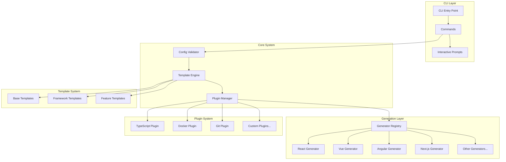
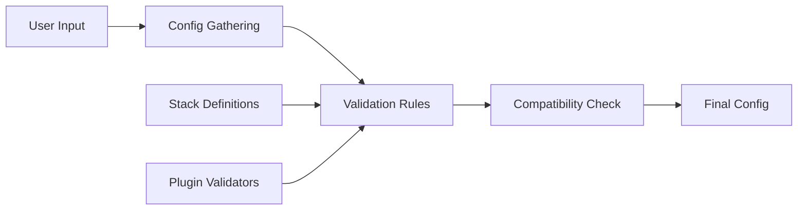
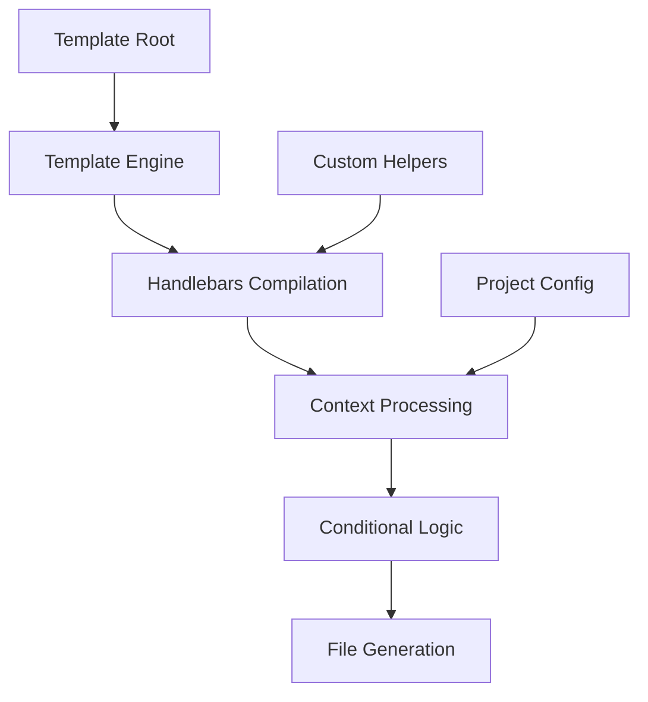
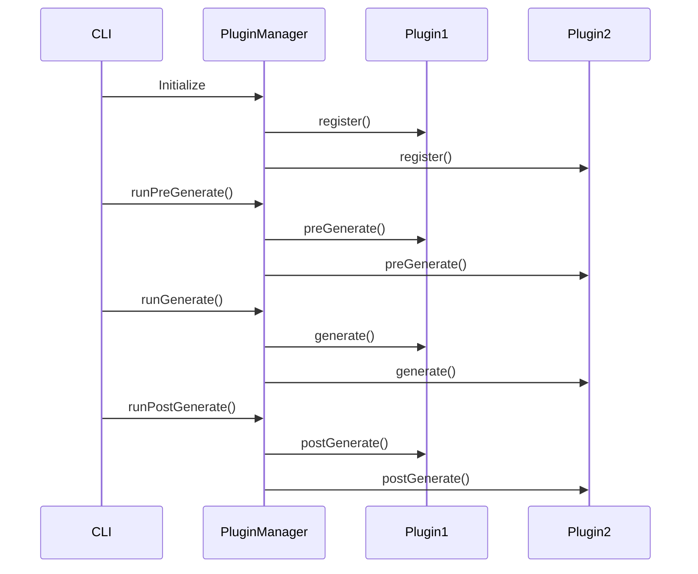
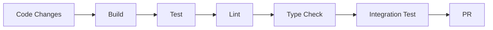
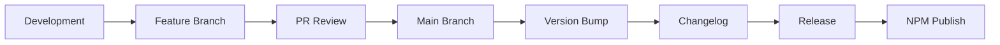

# Developer Guide

Complete guide for contributing to and extending Precast CLI.

## Architecture Overview

Precast CLI follows a modular architecture with clear separation of concerns:



## Core Components

### Configuration System

The configuration system validates and manages project settings:



**Key Files:**

- `src/core/config-validator.ts` - Configuration validation
- `src/prompts/config-prompts.ts` - Interactive prompts
- `packages/shared/stack-config.ts` - Stack definitions

### Template Engine

Handlebars-based template processing with conditional logic:



**Features:**

- Handlebars template compilation
- Conditional file processing
- Custom helper functions
- Directory structure management

### Plugin Architecture

Extensible plugin system with lifecycle hooks:



**Plugin Hooks:**

- `validateConfig` - Validate configuration
- `transformConfig` - Transform configuration
- `preGenerate` - Pre-generation setup
- `generate` - Main generation logic
- `postGenerate` - Post-generation cleanup
- `beforeInstall` - Before dependency installation
- `afterInstall` - After dependency installation

## Project Structure

```
packages/cli/
├── src/
│   ├── commands/           # CLI commands
│   │   └── init.ts        # Main init command
│   ├── core/              # Core system
│   │   ├── config-validator.ts
│   │   ├── plugin-manager.ts
│   │   └── template-engine.ts
│   ├── generators/        # Framework generators
│   │   ├── index.ts
│   │   ├── react-template.ts
│   │   ├── vue-template.ts
│   │   └── ...
│   ├── plugins/           # Built-in plugins
│   │   └── typescript-plugin.ts
│   ├── prompts/           # Interactive prompts
│   │   └── config-prompts.ts
│   ├── templates/         # Template files
│   │   ├── frameworks/    # Framework-specific templates
│   │   ├── features/      # Feature templates
│   │   └── base/          # Base templates
│   ├── utils/             # Utility functions
│   │   ├── logger.ts
│   │   ├── template-path.ts
│   │   └── validation.ts
│   ├── cli.ts             # CLI entry point
│   └── index.ts           # Alternative entry point
├── tests/                 # Test files
├── docs/                  # Documentation
└── package.json
```

## Development Setup

### Prerequisites

- Node.js 18+
- Bun (for package management and testing)
- Git

### Local Development

1. **Clone the repository**:

   ```bash
   git clone https://github.com/your-org/precast-app.git
   cd precast-app
   ```

2. **Install dependencies**:

   ```bash
   bun install
   ```

3. **Build the CLI**:

   ```bash
   cd packages/cli
   bun run build
   ```

4. **Link for local testing**:

   ```bash
   npm link
   ```

5. **Test the CLI**:
   ```bash
   create-precast-app test-project
   ```

### Development Workflow



**Commands:**

```bash
# Development build with watch
bun run dev

# Run tests
bun test

# Lint code
bun run lint

# Type checking
bun run type-check

# Build for production
bun run build

# Run integration tests
bun run test:integration
```

## Creating Generators

### Generator Structure

Each framework generator follows this pattern:

```typescript
/**
 * Generates a [Framework] project template
 */
export async function generate[Framework]Template(
  config: ProjectConfig,
  projectPath: string
) {
  const templateRoot = getTemplateRoot();
  const templateEngine = createTemplateEngine(templateRoot);
  const pluginManager = getPluginManager();

  const context = {
    config,
    projectPath,
    templateEngine,
    logger: consola,
  };

  try {
    // Pre-generation hooks
    await pluginManager.runPreGenerate(context);

    // Copy base templates
    await templateEngine.copyTemplateDirectory(
      "frameworks/[framework]/base",
      projectPath,
      config,
      { overwrite: true }
    );

    // Copy source templates
    await templateEngine.copyTemplateDirectory(
      "frameworks/[framework]/src",
      path.join(projectPath, "src"),
      config,
      { overwrite: true }
    );

    // Process conditional templates
    await templateEngine.processConditionalTemplates([
      {
        condition: config.typescript,
        sourceDir: "features/typescript/[framework]",
      },
      {
        condition: config.styling === "tailwind",
        sourceDir: "features/tailwind/[framework]",
      },
    ], projectPath, config);

    // Post-generation hooks
    await pluginManager.runPostGenerate(context);

  } catch (error) {
    consola.error(`Failed to generate [Framework] template:`, error);
    throw error;
  }
}
```

### Adding a New Generator

1. **Create generator file**:

   ```bash
   touch src/generators/my-framework-template.ts
   ```

2. **Implement generator function**:

   ```typescript
   export async function generateMyFrameworkTemplate(config: ProjectConfig, projectPath: string) {
     // Implementation
   }
   ```

3. **Create template directory**:

   ```bash
   mkdir -p src/templates/frameworks/my-framework/{base,src}
   ```

4. **Add to generator registry**:

   ```typescript
   // In src/generators/index.ts
   import { generateMyFrameworkTemplate } from "./my-framework-template.js";

   export async function generateTemplate(config: ProjectConfig, projectPath: string) {
     switch (config.framework) {
       case "my-framework":
         await generateMyFrameworkTemplate(config, projectPath);
         break;
       // ... other cases
     }
   }
   ```

5. **Update stack configuration**:
   ```typescript
   // In packages/shared/stack-config.ts
   export const frameworkDefs = [
     // ... existing frameworks
     {
       id: "my-framework",
       name: "My Framework",
       description: "Description of my framework",
       // ... other properties
     },
   ];
   ```

## Creating Plugins

### Plugin Interface

```typescript
export interface Plugin {
  name: string;
  version?: string;
  description?: string;

  // Configuration hooks
  validateConfig?: (config: ProjectConfig) => { valid: boolean; errors?: string[] };
  transformConfig?: (config: ProjectConfig) => ProjectConfig;

  // Generation hooks
  preGenerate?: (context: PluginContext) => Promise<void> | void;
  generate?: (context: PluginContext) => Promise<void> | void;
  postGenerate?: (context: PluginContext) => Promise<void> | void;

  // Installation hooks
  beforeInstall?: (context: PluginContext) => Promise<void> | void;
  afterInstall?: (context: PluginContext) => Promise<void> | void;
}
```

### Example Plugin

```typescript
export const myPlugin = createPlugin({
  name: "my-plugin",
  version: "1.0.0",
  description: "My custom plugin",

  validateConfig(config: ProjectConfig) {
    const errors: string[] = [];

    // Add validation logic
    if (config.someCondition && !config.requiredField) {
      errors.push("Required field missing when condition is true");
    }

    return {
      valid: errors.length === 0,
      errors,
    };
  },

  transformConfig(config: ProjectConfig) {
    // Transform configuration if needed
    return {
      ...config,
      someField: "transformed-value",
    };
  },

  async generate(context: PluginContext) {
    // Add custom generation logic
    await context.templateEngine.processConditionalTemplates(
      [
        {
          condition: context.config.myFeature,
          sourceDir: "features/my-feature",
        },
      ],
      context.projectPath,
      context.config
    );
  },
});
```

### Registering Plugins

```typescript
// In your generator or initialization code
import { getPluginManager } from "../core/plugin-manager.js";
import { myPlugin } from "./my-plugin.js";

const pluginManager = getPluginManager();
pluginManager.register(myPlugin);
```

## Template System

### Template Structure

Templates use Handlebars with custom helpers:

```
src/templates/
├── frameworks/
│   ├── react/
│   │   ├── base/
│   │   │   ├── package.json.hbs
│   │   │   ├── _gitignore
│   │   │   └── README.md.hbs
│   │   └── src/
│   │       ├── App.tsx.hbs
│   │       └── index.tsx.hbs
│   └── vue/
│       ├── base/
│       └── src/
├── features/
│   ├── typescript/
│   │   ├── base/
│   │   │   └── tsconfig.json.hbs
│   │   ├── react/
│   │   └── vue/
│   └── tailwind/
│       ├── base/
│       └── config/
└── base/
    └── common/
```

### Handlebars Helpers

Built-in helpers for template logic:

```handlebars
{{! String manipulation }}
{{capitalize framework}}
{{kebabCase projectName}}
{{camelCase variableName}}

{{! Conditionals }}
{{#if typescript}}
  // TypeScript specific code
{{/if}}

{{#eq framework "react"}}
  // React specific code
{{/eq}}

{{#ifAny backend database}}
  // Show if either backend or database is set
{{/ifAny}}

{{#ifAll typescript (eq framework "react")}}
  // Show only for TypeScript React projects
{{/ifAll}}

{{! Arrays }}
{{#includes dependencies "express"}}
  // Express specific code
{{/includes}}
```

### File Naming Conventions

- `.hbs` extension for template files
- `_filename` becomes `.filename` (for dotfiles)
- Conditional file processing via `shouldSkipFile()`

## Testing

### Test Structure

```
tests/
├── core/                  # Core system tests
│   ├── template-engine.test.ts
│   ├── plugin-manager.test.ts
│   └── config-validator.test.ts
├── generators/            # Generator tests
│   ├── react.test.ts
│   └── vue.test.ts
├── integration/           # Integration tests
│   └── full-generation.test.ts
└── fixtures/              # Test fixtures
    ├── configs/
    └── templates/
```

### Writing Tests

```typescript
import { describe, it, expect, beforeEach, afterEach } from "bun:test";
import { ConfigValidator } from "../src/core/config-validator.js";

describe("ConfigValidator", () => {
  let validator: ConfigValidator;

  beforeEach(() => {
    validator = new ConfigValidator();
  });

  it("should validate valid configuration", () => {
    const config = {
      name: "test-project",
      framework: "react",
      backend: "express",
      database: "postgres",
      orm: "prisma",
      styling: "tailwind",
      typescript: true,
      git: true,
      docker: false,
    };

    const result = validator.validate(config);
    expect(result.valid).toBe(true);
    expect(result.errors).toHaveLength(0);
  });

  it("should reject invalid framework", () => {
    const config = {
      // ... config with invalid framework
      framework: "invalid-framework",
    };

    const result = validator.validate(config);
    expect(result.valid).toBe(false);
    expect(result.errors).toContain("Invalid framework");
  });
});
```

### Running Tests

```bash
# Run all tests
bun test

# Run specific test file
bun test tests/core/config-validator.test.ts

# Run tests in watch mode
bun test --watch

# Run integration tests
bun test tests/integration/

# Generate coverage report
bun test --coverage
```

## Contributing Guidelines

### Code Standards

- **TypeScript**: Strict mode enabled
- **ESLint**: Configured for TypeScript and Node.js
- **Prettier**: Consistent code formatting
- **JSDoc**: Document all public APIs

### Commit Messages

Follow conventional commit format:

```
<type>(<scope>): <description>

[optional body]

[optional footer(s)]
```

Types:

- `feat`: New feature
- `fix`: Bug fix
- `docs`: Documentation changes
- `style`: Code style changes
- `refactor`: Code refactoring
- `test`: Test changes
- `chore`: Build/tooling changes

Examples:

```
feat(generators): add Solid.js generator
fix(template-engine): resolve path resolution issue
docs(api): update plugin development guide
```

### Pull Request Process

1. **Fork and branch**:

   ```bash
   git checkout -b feature/my-new-feature
   ```

2. **Make changes** following code standards

3. **Add tests** for new functionality

4. **Update documentation** if needed

5. **Run quality checks**:

   ```bash
   bun run lint
   bun run type-check
   bun test
   ```

6. **Create pull request** with:
   - Clear description
   - Link to related issues
   - Screenshots if UI changes
   - Breaking change notes

### Release Process



Releases use semantic versioning:

- `MAJOR`: Breaking changes
- `MINOR`: New features (backward compatible)
- `PATCH`: Bug fixes

## Debugging

### Debug Mode

Enable debug logging:

```bash
DEBUG=1 create-precast-app my-project
```

### Common Issues

**Template path resolution**:

- Check `getTemplateRoot()` logic
- Verify template directory structure
- Debug with `console.log` in development

**Plugin execution**:

- Add logging to plugin hooks
- Check plugin registration
- Verify hook execution order

**Configuration validation**:

- Test validation rules in isolation
- Check rule execution order
- Verify error message clarity

### Development Tools

- **VS Code Extensions**: TypeScript, ESLint, Prettier
- **Debugging**: Node.js debugger, VS Code debugger
- **Testing**: Bun test runner, coverage reports
- **Profiling**: Node.js profiler, memory usage analysis
