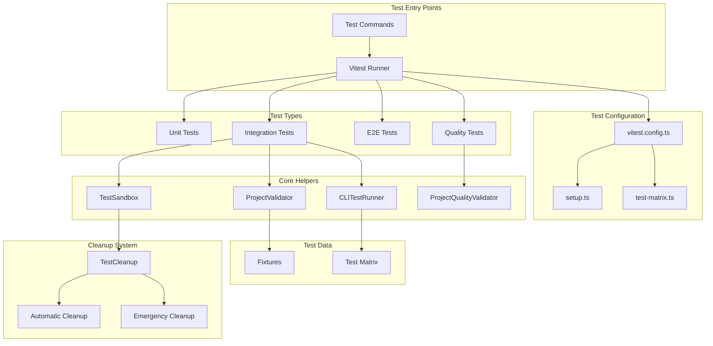
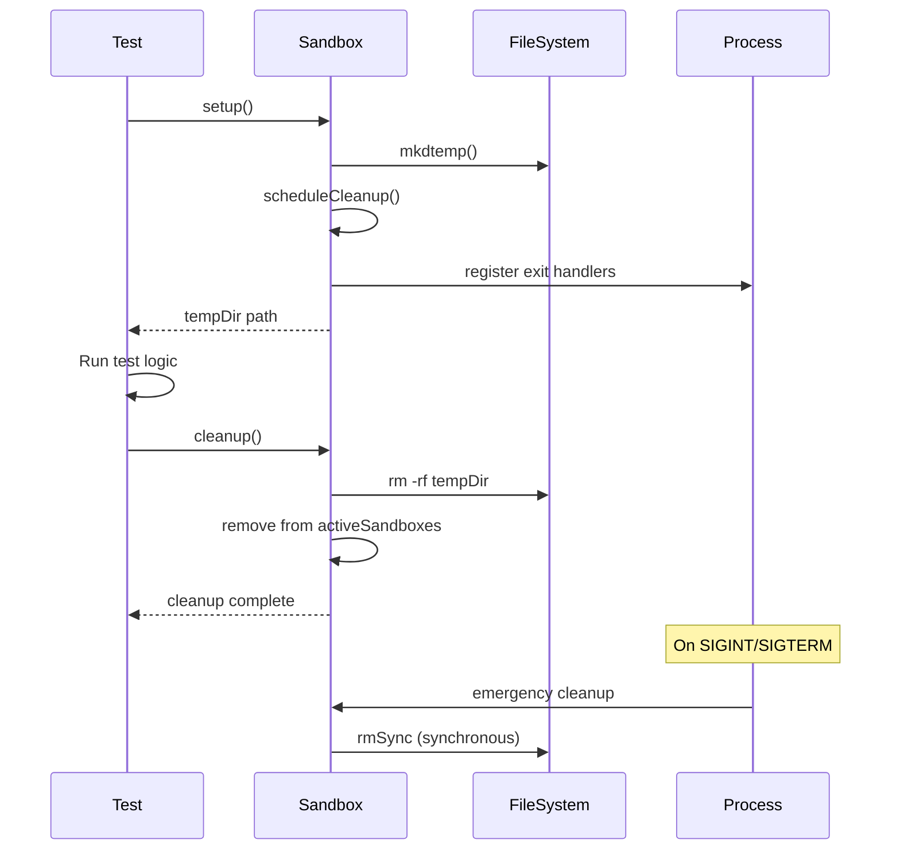
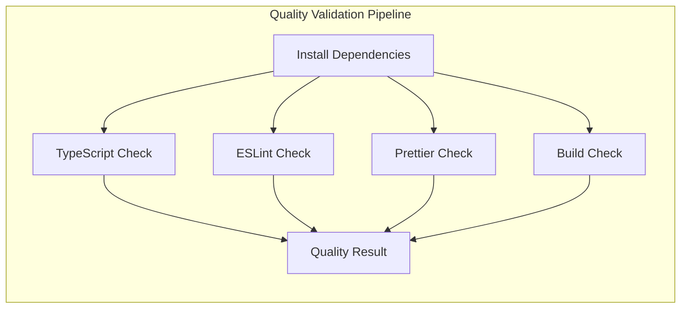
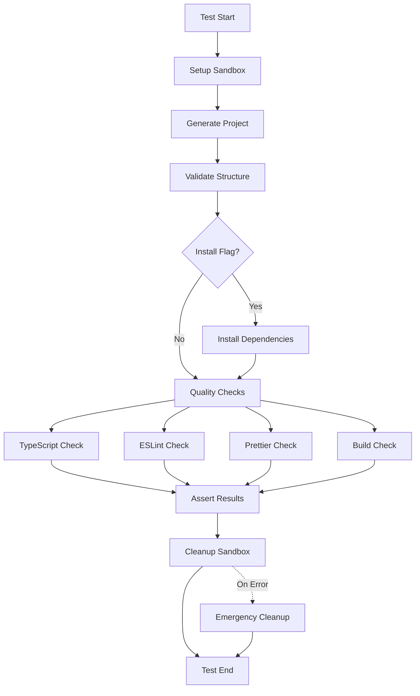
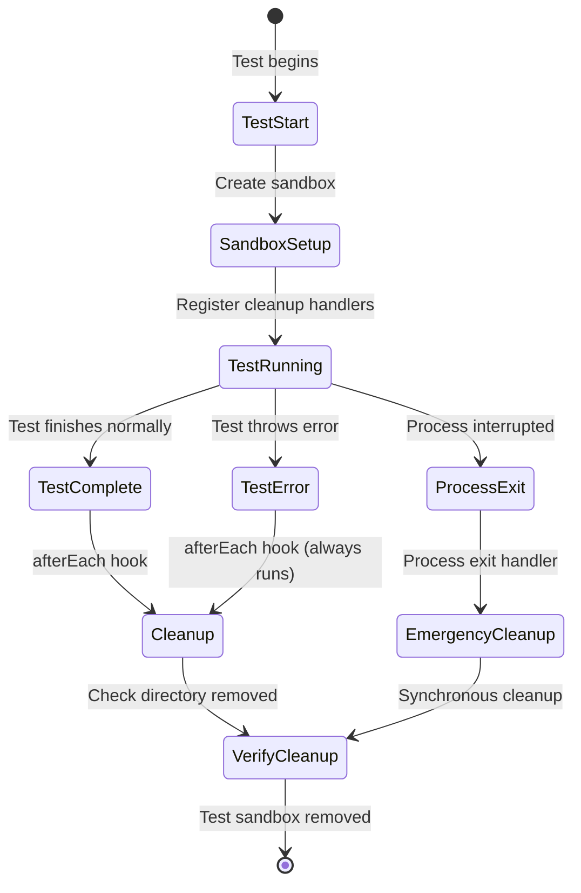
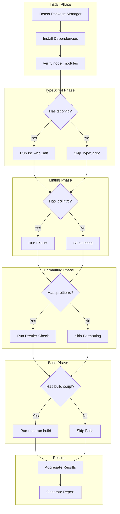

# CLI Testing Framework Documentation

## Table of Contents

1. [Overview](#overview)
2. [Architecture](#architecture)
3. [Test Structure](#test-structure)
4. [Core Components](#core-components)
5. [Test Lifecycle](#test-lifecycle)
6. [Writing Tests](#writing-tests)
7. [Running Tests](#running-tests)
8. [Cleanup System](#cleanup-system)
9. [Quality Validation](#quality-validation)
10. [Best Practices](#best-practices)
11. [Troubleshooting](#troubleshooting)

## Overview

The Precast CLI testing framework is a comprehensive, modular system designed to test CLI project generation with automatic cleanup, quality validation, and proper isolation. The framework ensures zero test pollution through automatic cleanup and provides detailed validation of generated projects.

### Key Features

- 🧹 **Automatic Cleanup** - Zero leftover test directories
- 🔒 **Test Isolation** - Each test runs in its own sandbox
- ✅ **Quality Validation** - Type, lint, and format checking
- 📦 **Install Verification** - Full dependency installation testing
- 🎯 **Fixture-Based Testing** - Reusable test configurations
- 📊 **Matrix Testing** - Systematic framework/backend combinations

## Architecture



## Test Structure

```
packages/cli/
├── tests/
│   ├── config/                    # Test configuration
│   │   ├── vitest.config.ts      # Vitest configuration
│   │   ├── setup.ts              # Global test setup
│   │   └── test-matrix.ts        # Framework/backend combinations
│   │
│   ├── fixtures/                  # Test data and expectations
│   │   └── index.ts              # Project fixtures and validation rules
│   │
│   ├── helpers/                   # Test utilities
│   │   ├── sandbox.ts            # Test isolation and cleanup
│   │   ├── test-cli.ts           # CLI command runner
│   │   ├── project-validator.ts  # Structure validation
│   │   ├── project-quality-validator.ts # Quality checks
│   │   └── cleanup.ts            # Cleanup utilities
│   │
│   ├── integration/              # Integration tests
│   │   ├── project-generation.test.ts
│   │   └── project-quality.test.ts
│   │
│   └── e2e/                      # End-to-end tests
│       └── matrix-combinations.test.ts
│
├── src/__tests__/                # Unit tests (next to source)
│   └── core/
│       └── template-engine.test.ts
│
└── scripts/
    └── test-cli.sh               # Test runner script
```

## Core Components

### 1. TestSandbox (`tests/helpers/sandbox.ts`)

Provides isolated test environments with automatic cleanup.

```typescript
export class TestSandbox {
  private tempDir: string | null = null;
  private static activeSandboxes: Set<TestSandbox> = new Set();
  private cleanupScheduled = false;

  async setup(): Promise<string>;
  async cleanup(): Promise<void>;
  getPath(relativePath: string = ""): string;
  getTempDir(): string;
  static async globalCleanup(): Promise<void>;
}
```

**Key Features:**

- Creates temporary directories for each test
- Automatic cleanup on test completion
- Emergency cleanup on process exit
- Tracks all active sandboxes globally

**Lifecycle:**



### 2. CLITestRunner (`tests/helpers/test-cli.ts`)

Wraps CLI execution for testing purposes.

```typescript
export class CLITestRunner {
  async runCommand(args: string[], options?: RunOptions): Promise<CLIResult>;
  async generateProject(
    projectName: string,
    combination: TestCombination,
    workingDir: string,
    options?: { install?: boolean }
  ): Promise<CLIResult>;
  async validateProject(
    projectPath: string,
    combination: TestCombination
  ): Promise<ValidationResult>;
}
```

**Features:**

- Executes CLI commands with proper error handling
- Supports timeout configuration
- Handles install flag for dependency testing
- Provides structured result objects

### 3. ProjectValidator (`tests/helpers/project-validator.ts`)

Validates project structure and configuration.

```typescript
export class ProjectValidator {
  async validateProject(
    projectPath: string,
    fixture: ProjectFixture
  ): Promise<DetailedValidationResult>;
}
```

**Validation Types:**

- File existence checks
- Package.json validation
- Dependency verification
- Script existence
- Configuration validity

### 4. ProjectQualityValidator (`tests/helpers/project-quality-validator.ts`)

Performs comprehensive quality checks on generated projects.

```typescript
export class ProjectQualityValidator {
  async runFullQualityCheck(
    projectPath: string,
    options?: QualityCheckOptions
  ): Promise<QualityCheckResult>;
}
```

**Quality Checks:**



## Test Lifecycle

### Complete Test Flow



## Writing Tests

### 1. Basic Integration Test

```typescript
import { describe, it, expect, beforeEach, afterEach } from "vitest";
import { CLITestRunner } from "../helpers/test-cli";
import { TestSandbox } from "../helpers/sandbox";

describe("My CLI Feature", () => {
  let testRunner: CLITestRunner;
  let sandbox: TestSandbox;

  beforeEach(async () => {
    testRunner = new CLITestRunner();
    sandbox = new TestSandbox();
    await sandbox.setup();
  });

  afterEach(async () => {
    await sandbox.cleanup();
  });

  it("should generate project with my feature", async () => {
    const projectName = "test-my-feature";
    const workingDir = sandbox.getTempDir();

    const result = await testRunner.runCommand(
      ["init", projectName, "--framework=react", "--my-feature", "--yes"],
      { cwd: workingDir }
    );

    expect(result.exitCode).toBe(0);

    const projectPath = sandbox.getPath(projectName);
    // Add your assertions here
  });
});
```

### 2. Adding a New Fixture

```typescript
// tests/fixtures/index.ts
export const MY_FIXTURE: ProjectFixture = {
  name: "my-framework-backend",
  config: {
    name: "my-framework-backend",
    framework: "my-framework",
    backend: "my-backend",
    database: "postgres",
    orm: "prisma",
    styling: "tailwind",
    runtime: "node",
    typescript: true,
    category: "common",
    expectedDuration: 8000,
  },
  expectedFiles: ["package.json", "src/index.ts", "config/app.config.ts"],
  expectedDependencies: ["my-framework", "my-backend"],
  expectedDevDependencies: ["typescript", "@types/node"],
  validationRules: [
    {
      type: "file-exists",
      path: "src/index.ts",
      description: "Entry point exists",
    },
    {
      type: "script-exists",
      script: "dev",
      description: "Development script exists",
    },
  ],
  skipInstall: false, // Set to true to test with installation
};

FIXTURES.push(MY_FIXTURE);
```

### 3. Quality Test with Installation

```typescript
import { ProjectQualityValidator } from "../helpers/project-quality-validator";

it("should pass all quality checks", async () => {
  const projectName = "quality-test-project";
  const workingDir = sandbox.getTempDir();

  // Generate with install flag
  const result = await testRunner.generateProject(
    projectName,
    myTestConfig,
    workingDir,
    { install: true } // Enable installation
  );

  expect(result.exitCode).toBe(0);

  const projectPath = sandbox.getPath(projectName);
  const qualityValidator = new ProjectQualityValidator();

  const qualityResult = await qualityValidator.runFullQualityCheck(projectPath, {
    skipInstall: true, // Already installed
    skipTypeCheck: false,
    skipLint: false,
    skipPrettier: false,
    skipBuild: false,
    timeout: 180000,
  });

  // Log any failures for debugging
  if (!qualityResult.passed) {
    console.error("Quality check failures:", {
      typeErrors: qualityResult.typeCheck?.errors,
      lintErrors: qualityResult.lintCheck?.errors,
      formatIssues: qualityResult.prettierCheck?.unformattedFiles,
      buildErrors: qualityResult.buildCheck?.errors,
    });
  }

  expect(qualityResult.passed).toBe(true);
}, 300000); // 5 minute timeout for install + checks
```

### 4. Matrix Testing

```typescript
// tests/config/test-matrix.ts
export const TEST_MATRIX = {
  critical: [
    // Most important combinations - always test
    { framework: "react", backend: "express", database: "postgres" },
    { framework: "next", backend: "none", database: "none" },
  ],
  common: [
    // Common use cases - test in PR
    { framework: "vue", backend: "fastify", database: "mysql" },
  ],
  edge: [
    // Edge cases - test nightly
    { framework: "vanilla", backend: "none", database: "none" },
  ],
};

// Use in tests
TEST_MATRIX.critical.forEach((combination) => {
  it(`should generate ${combination.framework}-${combination.backend}`, async () => {
    const result = await testRunner.generateProject(
      `test-${combination.framework}`,
      combination,
      sandbox.getTempDir()
    );
    expect(result.exitCode).toBe(0);
  });
});
```

## Running Tests

### Command Line Options

```bash
# Build CLI first (required)
pnpm run build

# Run all tests
pnpm test

# Run specific test suites
pnpm test:unit          # Unit tests only
pnpm test:integration   # Integration tests
pnpm test:quality       # Quality tests with install
pnpm test:e2e          # End-to-end tests

# Run with options
pnpm test:all          # Run all test suites
pnpm test:full         # Full suite with quality and E2E

# Run specific test file
pnpm vitest run tests/integration/project-generation.test.ts --config tests/config/vitest.config.ts

# Run with pattern matching
pnpm vitest run --config tests/config/vitest.config.ts -- --testNamePattern="should generate react"

# Watch mode for development
pnpm test:watch

# UI mode for debugging
pnpm test:ui
```

### Environment Variables

```bash
# Enable quality tests (slower, includes install)
RUN_QUALITY_TESTS=true pnpm test:quality

# Enable E2E tests (slowest, full matrix)
RUN_E2E=true pnpm test:e2e

# Enable full testing (install + validate)
RUN_FULL_TESTS=true pnpm test:integration

# Run everything
RUN_QUALITY_TESTS=true RUN_E2E=true pnpm test:all
```

### Test Script (`scripts/test-cli.sh`)

```bash
#!/bin/bash
# Comprehensive test runner with cleanup verification

# Build CLI
pnpm run build

# Clean old test files
rm -rf /tmp/precast-test-* /tmp/quality-* /tmp/matrix-*

# Run test suites
pnpm test:unit
pnpm test:integration

if [ "$RUN_QUALITY_TESTS" = "true" ]; then
  pnpm test:quality
fi

if [ "$RUN_E2E" = "true" ]; then
  pnpm test:e2e
fi

# Verify cleanup
REMAINING=$(ls /tmp/ | grep precast-test- | wc -l)
if [ "$REMAINING" -gt "0" ]; then
  echo "⚠️ Warning: $REMAINING test directories not cleaned"
else
  echo "✅ All test directories cleaned successfully"
fi
```

## Cleanup System

### Automatic Cleanup Flow



### Cleanup Mechanisms

1. **Normal Cleanup** (afterEach hook)

   ```typescript
   afterEach(async () => {
     await sandbox.cleanup(); // Async cleanup
   });
   ```

2. **Emergency Cleanup** (process handlers)

   ```typescript
   process.once("exit", () => {
     fs.rmSync(tempDir, { recursive: true, force: true });
   });
   ```

3. **Global Cleanup** (all sandboxes)

   ```typescript
   await TestSandbox.globalCleanup();
   ```

4. **Manual Cleanup** (if needed)
   ```typescript
   await TestCleanup.cleanupOldTestFiles();
   ```

### Cleanup Verification

The framework automatically verifies cleanup:

```typescript
// In test
expect(existsSync(tempDirPath)).toBe(false);

// In shell script
ls -la /tmp/ | grep precast-test- | wc -l  # Should be 0

// In test output
stdout: ✓ Cleaned up sandbox: /tmp/precast-test-xxxxx
```

## Quality Validation

### Validation Pipeline



### Quality Check Results

```typescript
interface QualityCheckResult {
  passed: boolean;
  typeCheck?: {
    passed: boolean;
    errors: string[];
    output: string;
  };
  lintCheck?: {
    passed: boolean;
    errors: string[];
    warnings: string[];
    output: string;
  };
  prettierCheck?: {
    passed: boolean;
    unformattedFiles: string[];
    output: string;
  };
  installCheck?: {
    passed: boolean;
    errors: string[];
    output: string;
  };
  buildCheck?: {
    passed: boolean;
    errors: string[];
    output: string;
  };
}
```

## Best Practices

### 1. Test Organization

```typescript
describe("Feature Category", () => {
  describe("Specific Feature", () => {
    it("should handle specific case", async () => {
      // Single, focused test
    });
  });
});
```

### 2. Sandbox Usage

```typescript
// ✅ Good - Clean sandbox per test
beforeEach(async () => {
  sandbox = new TestSandbox();
  await sandbox.setup();
});

afterEach(async () => {
  await sandbox.cleanup();
});

// ❌ Bad - Shared sandbox
before(async () => {
  sandbox = new TestSandbox(); // Shared across tests
});
```

### 3. Timeout Configuration

```typescript
// Short operations (no install)
it("should generate quickly", async () => {
  // test logic
}, 10000); // 10 seconds

// With installation
it("should install and validate", async () => {
  // test logic
}, 300000); // 5 minutes

// Complex E2E
it("should handle full workflow", async () => {
  // test logic
}, 600000); // 10 minutes
```

### 4. Error Handling

```typescript
const result = await testRunner.generateProject(...);

if (result.exitCode !== 0) {
  console.error('Generation failed:', {
    stdout: result.stdout,
    stderr: result.stderr,
    exitCode: result.exitCode
  });
}

expect(result.exitCode).toBe(0);
```

### 5. Fixture Reuse

```typescript
// Define once
const REACT_FIXTURE = {
  /* ... */
};

// Reuse in multiple tests
it("test 1", async () => {
  const result = await validator.validateProject(path, REACT_FIXTURE);
});

it("test 2", async () => {
  const result = await validator.validateProject(path, REACT_FIXTURE);
});
```

## Troubleshooting

### Common Issues and Solutions

#### 1. Tests Failing with "CLI not built"

**Problem:** CLI not compiled before running tests

```
Error: CLI not built. Expected at: dist/cli.js
```

**Solution:**

```bash
pnpm run build
pnpm test
```

#### 2. Timeout Errors

**Problem:** Test exceeds default timeout

```
Error: Test timed out in 30000ms
```

**Solution:**

```typescript
it("slow test", async () => {
  // test logic
}, 120000); // Increase timeout
```

#### 3. Cleanup Not Working

**Problem:** Test directories remain after tests

**Debug Steps:**

```bash
# Check for leftover directories
ls -la /tmp/ | grep precast-test-

# Manual cleanup
rm -rf /tmp/precast-test-*

# Run with cleanup verification
pnpm test:all
```

#### 4. Module Resolution Errors

**Problem:** Cannot find module errors

```
Error: Cannot find module '@/core/template-engine'
```

**Solution:** Use relative imports in test files

```typescript
// ❌ Bad
import { TemplateEngine } from "@/core/template-engine";

// ✅ Good
import { TemplateEngine } from "../template-engine";
```

#### 5. Install Failures in Tests

**Problem:** Dependencies fail to install during tests

**Debug:**

```typescript
const result = await testRunner.generateProject(projectName, config, workingDir, { install: true });

// Log output for debugging
console.log("Install output:", result.stdout);
console.log("Install errors:", result.stderr);
```

### Debug Mode

Enable detailed logging:

```typescript
// In test
console.info("Project path:", projectPath);
console.info("Validation result:", validation);

// In quality validator
if (!qualityResult.passed) {
  console.error("Quality failures:", {
    typeCheck: qualityResult.typeCheck,
    lintCheck: qualityResult.lintCheck,
    prettierCheck: qualityResult.prettierCheck,
    buildCheck: qualityResult.buildCheck,
  });
}
```

### Performance Profiling

```typescript
const startTime = performance.now();
const result = await testRunner.generateProject(...);
const duration = performance.now() - startTime;

console.info(`Generation took ${duration}ms`);
expect(duration).toBeLessThan(10000);
```

## Advanced Topics

### Custom Test Helpers

```typescript
// tests/helpers/custom-validator.ts
export class CustomValidator {
  async validateCustomFeature(projectPath: string): Promise<boolean> {
    // Custom validation logic
    const configExists = existsSync(path.join(projectPath, "custom.config.js"));
    const hasCustomDep = await this.checkDependency(projectPath, "custom-lib");

    return configExists && hasCustomDep;
  }
}
```

### Parallel Test Execution

```typescript
// Run multiple tests in parallel
const results = await Promise.all([
  testRunner.generateProject("project1", config1, dir1),
  testRunner.generateProject("project2", config2, dir2),
  testRunner.generateProject("project3", config3, dir3),
]);

results.forEach((result, index) => {
  expect(result.exitCode).toBe(0);
});
```

### Snapshot Testing

```typescript
import { expect } from "vitest";

it("should match project structure snapshot", async () => {
  const projectPath = sandbox.getPath("test-project");
  const structure = await getProjectStructure(projectPath);

  expect(structure).toMatchSnapshot();
});
```

### CI/CD Integration

```yaml
# .github/workflows/test.yml
name: CLI Tests

on: [push, pull_request]

jobs:
  test:
    runs-on: ubuntu-latest
    steps:
      - uses: actions/checkout@v3
      - uses: actions/setup-node@v3
      - run: pnpm install
      - run: pnpm run build

      # Quick tests
      - run: pnpm test:integration

      # Full tests on main branch
      - if: github.ref == 'refs/heads/main'
        run: RUN_QUALITY_TESTS=true RUN_E2E=true pnpm test:all
```

## Summary

The Precast CLI testing framework provides:

1. **Comprehensive Testing** - Unit, integration, E2E, and quality tests
2. **Automatic Cleanup** - Zero test pollution guaranteed
3. **Quality Validation** - TypeScript, ESLint, Prettier, and build checks
4. **Test Isolation** - Each test in its own sandbox
5. **Flexible Configuration** - Fixtures, matrices, and custom validators
6. **Developer Experience** - Clear errors, easy debugging, fast feedback

The framework ensures that:

- All generated projects are valid and functional
- No test artifacts are left behind
- Tests are maintainable and extensible
- Quality standards are enforced
- Development workflow is efficient

For questions or improvements, please refer to the [contributing guide](../../../CONTRIBUTING.md) or open an issue on GitHub.
