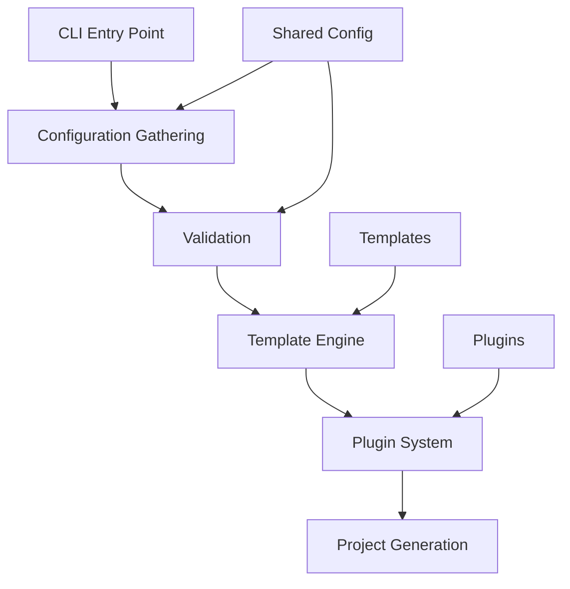

# Precast CLI Documentation

Precast CLI is a powerful project scaffolding tool that generates modern web applications with your chosen technology stack.

## Quick Start

```bash
npx create-precast-app my-project
```

## Documentation Structure

- [User Guide](./user-guide/README.md) - Getting started and usage instructions
- [Developer Guide](./developers/README.md) - Architecture and development documentation
- [API Reference](./api/README.md) - Complete API documentation
- [Templates](./templates/README.md) - Template system documentation
- [Plugins](./plugins/README.md) - Plugin development guide

## Features

- **Multi-Framework Support**: React, Vue, Angular, Next.js, Nuxt, Svelte, Solid, Astro, Remix, Vite, and Vanilla JavaScript
- **Backend Integration**: Express, FastAPI, Hono, or frontend-only projects
- **Database Support**: PostgreSQL, MySQL, MongoDB, SQLite, Firebase, Supabase
- **ORM Integration**: Prisma, Drizzle, TypeORM, Mongoose
- **Styling Options**: Tailwind CSS, SCSS, CSS, Styled Components
- **TypeScript Support**: Optional TypeScript configuration
- **Development Tools**: Git initialization, Docker configuration
- **Plugin Architecture**: Extensible plugin system

## Architecture Overview



## Technology Stack

- **Language**: TypeScript
- **CLI Framework**: Commander.js
- **Prompts**: @clack/prompts
- **Template Engine**: Handlebars
- **File System**: fs-extra
- **Validation**: Zod
- **Testing**: Bun Test