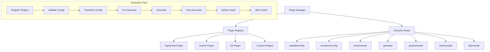

# Plugin System Documentation

The Precast CLI plugin system allows for extensible functionality through lifecycle hooks and configuration transformations.

## Plugin Architecture



## Plugin Interface

Every plugin implements the `Plugin` interface:

```typescript
interface Plugin {
  name: string;
  version?: string;
  description?: string;

  // Configuration hooks
  validateConfig?: (config: ProjectConfig) => { valid: boolean; errors?: string[] };
  transformConfig?: (config: ProjectConfig) => ProjectConfig;

  // Generation hooks
  preGenerate?: (context: PluginContext) => Promise<void> | void;
  generate?: (context: PluginContext) => Promise<void> | void;
  postGenerate?: (context: PluginContext) => Promise<void> | void;

  // Installation hooks
  beforeInstall?: (context: PluginContext) => Promise<void> | void;
  afterInstall?: (context: PluginContext) => Promise<void> | void;
}
```

## Plugin Context

Plugins receive a context object with access to core systems:

```typescript
interface PluginContext {
  config: ProjectConfig;           // Project configuration
  projectPath: string;             // Target project directory
  templateEngine: TemplateEngine;  // Template processing engine
  logger: typeof consola;          // Logging utility
}
```

## Lifecycle Hooks

### Configuration Phase

#### validateConfig

Validates project configuration and returns errors:

```typescript
validateConfig(config: ProjectConfig): { valid: boolean; errors?: string[] } {
  const errors: string[] = [];
  
  // Validation logic
  if (config.framework === "angular" && !config.typescript) {
    errors.push("Angular requires TypeScript");
  }
  
  return {
    valid: errors.length === 0,
    errors,
  };
}
```

#### transformConfig

Modifies configuration before generation:

```typescript
transformConfig(config: ProjectConfig): ProjectConfig {
  // Force TypeScript for Angular
  if (config.framework === "angular") {
    return {
      ...config,
      typescript: true,
    };
  }
  
  return config;
}
```

### Generation Phase

#### preGenerate

Setup tasks before template generation:

```typescript
async preGenerate(context: PluginContext): Promise<void> {
  const { config, logger } = context;
  
  if (config.typescript) {
    logger.debug("Preparing TypeScript configuration");
    // Setup tasks
  }
}
```

#### generate

Main plugin logic and template processing:

```typescript
async generate(context: PluginContext): Promise<void> {
  const { config, projectPath, templateEngine } = context;
  
  if (config.docker) {
    await templateEngine.processConditionalTemplates([
      {
        condition: true,
        sourceDir: "features/docker/base",
      },
      {
        condition: config.database === "postgres",
        sourceDir: "features/docker/postgres",
      },
    ], projectPath, config);
  }
}
```

#### postGenerate

Cleanup and finalization tasks:

```typescript
async postGenerate(context: PluginContext): Promise<void> {
  const { config, logger } = context;
  
  if (config.typescript) {
    logger.success("TypeScript configuration completed");
  }
}
```

### Installation Phase

#### beforeInstall

Tasks before dependency installation:

```typescript
async beforeInstall(context: PluginContext): Promise<void> {
  const { config, projectPath } = context;
  
  // Prepare environment for installation
  if (config.docker) {
    // Set up Docker environment
  }
}
```

#### afterInstall

Tasks after dependency installation:

```typescript
async afterInstall(context: PluginContext): Promise<void> {
  const { config, projectPath } = context;
  
  // Post-install setup
  if (config.typescript) {
    // Run TypeScript type checking
  }
}
```

## Built-in Plugins

### TypeScript Plugin

Handles TypeScript configuration and validation:

```typescript
export const typescriptPlugin = createPlugin({
  name: "typescript",
  version: "1.0.0",
  description: "Adds TypeScript support and configuration",

  validateConfig(config: ProjectConfig) {
    const errors: string[] = [];
    
    if (config.framework === "angular" && !config.typescript) {
      errors.push("Angular projects require TypeScript");
    }

    return {
      valid: errors.length === 0,
      errors,
    };
  },

  transformConfig(config: ProjectConfig) {
    if (config.framework === "angular") {
      return {
        ...config,
        typescript: true,
      };
    }
    return config;
  },

  async generate(context: PluginContext) {
    if (!context.config.typescript) return;

    const { templateEngine, projectPath, config } = context;

    await templateEngine.processConditionalTemplates([
      {
        condition: true,
        sourceDir: "features/typescript/base",
      },
      {
        condition: config.framework === "react",
        sourceDir: "features/typescript/react",
      },
      {
        condition: config.framework === "vue",
        sourceDir: "features/typescript/vue",
      },
    ], projectPath, config);
  },
});
```

## Creating Custom Plugins

### Basic Plugin Structure

```typescript
import { createPlugin } from "../core/plugin-manager.js";
import type { ProjectConfig, PluginContext } from "../types.js";

export const myCustomPlugin = createPlugin({
  name: "my-custom-plugin",
  version: "1.0.0",
  description: "Adds custom functionality to generated projects",

  // Implement required hooks
  validateConfig(config: ProjectConfig) {
    // Validation logic
    return { valid: true };
  },

  async generate(context: PluginContext) {
    // Generation logic
  },
});
```

### Advanced Plugin Example

```typescript
export const dockerPlugin = createPlugin({
  name: "docker",
  version: "1.0.0",
  description: "Adds Docker configuration to projects",

  validateConfig(config: ProjectConfig) {
    const errors: string[] = [];
    const warnings: string[] = [];

    // Docker is most useful with databases
    if (config.docker && config.database === "none") {
      warnings.push("Docker is most beneficial when using a database");
    }

    // Check for conflicting configurations
    if (config.docker && config.backend === "none" && config.database !== "none") {
      errors.push("Cannot use database without backend in Docker setup");
    }

    return {
      valid: errors.length === 0,
      errors,
      warnings,
    };
  },

  async preGenerate(context: PluginContext) {
    if (!context.config.docker) return;

    context.logger.debug("Preparing Docker configuration");
    
    // Validate Docker requirements
    // Set up environment variables
  },

  async generate(context: PluginContext) {
    if (!context.config.docker) return;

    const { config, projectPath, templateEngine } = context;

    // Generate base Docker files
    await templateEngine.processConditionalTemplates([
      {
        condition: true,
        sourceDir: "features/docker/base",
      },
    ], projectPath, config);

    // Generate database-specific Docker configuration
    if (config.database !== "none") {
      await templateEngine.processConditionalTemplates([
        {
          condition: config.database === "postgres",
          sourceDir: "features/docker/postgres",
        },
        {
          condition: config.database === "mysql",
          sourceDir: "features/docker/mysql",
        },
        {
          condition: config.database === "mongodb",
          sourceDir: "features/docker/mongodb",
        },
      ], projectPath, config);
    }

    // Generate framework-specific Docker configuration
    await templateEngine.processConditionalTemplates([
      {
        condition: config.framework === "next",
        sourceDir: "features/docker/next",
      },
      {
        condition: config.framework === "nuxt",
        sourceDir: "features/docker/nuxt",
      },
    ], projectPath, config);
  },

  async postGenerate(context: PluginContext) {
    if (!context.config.docker) return;

    const { logger } = context;
    logger.success("Docker configuration generated");
    logger.info("Run 'docker-compose up' to start your development environment");
  },
});
```

### Plugin with File Modifications

```typescript
export const packageJsonPlugin = createPlugin({
  name: "package-json-enhancer",
  version: "1.0.0",
  description: "Enhances package.json with additional scripts and metadata",

  async postGenerate(context: PluginContext) {
    const { projectPath, config } = context;
    const packageJsonPath = path.join(projectPath, "package.json");

    if (await pathExists(packageJsonPath)) {
      const packageJson = await readJson(packageJsonPath);

      // Add custom scripts
      packageJson.scripts = {
        ...packageJson.scripts,
        "type-check": config.typescript ? "tsc --noEmit" : undefined,
        "lint:fix": "eslint . --fix",
        "format": "prettier --write .",
      };

      // Add metadata
      packageJson.keywords = [
        config.framework,
        config.backend !== "none" ? config.backend : null,
        config.database !== "none" ? config.database : null,
        config.typescript ? "typescript" : "javascript",
      ].filter(Boolean);

      // Write back to file
      await writeJson(packageJsonPath, packageJson, { spaces: 2 });
    }
  },
});
```

## Plugin Registration

### Manual Registration

```typescript
import { getPluginManager } from "./core/plugin-manager.js";
import { myCustomPlugin } from "./plugins/my-custom-plugin.js";

const pluginManager = getPluginManager();
pluginManager.register(myCustomPlugin);
```

### Auto-registration System

```typescript
// In src/plugins/index.ts
import { getPluginManager } from "../core/plugin-manager.js";
import { typescriptPlugin } from "./typescript-plugin.js";
import { dockerPlugin } from "./docker-plugin.js";
import { gitPlugin } from "./git-plugin.js";

export function registerBuiltinPlugins() {
  const pluginManager = getPluginManager();
  
  // Register built-in plugins
  pluginManager.register(typescriptPlugin);
  pluginManager.register(dockerPlugin);
  pluginManager.register(gitPlugin);
}

// Auto-register on import
registerBuiltinPlugins();
```

### Plugin Discovery

```typescript
// Plugin discovery from directory
export async function discoverPlugins(pluginDir: string) {
  const pluginManager = getPluginManager();
  const pluginFiles = await globby("*.js", { cwd: pluginDir });

  for (const file of pluginFiles) {
    try {
      const pluginModule = await import(path.join(pluginDir, file));
      
      if (pluginModule.plugin && typeof pluginModule.plugin === "object") {
        pluginManager.register(pluginModule.plugin);
      }
    } catch (error) {
      console.warn(`Failed to load plugin ${file}:`, error);
    }
  }
}
```

## Plugin Communication

### Inter-plugin Communication

```typescript
export const pluginA = createPlugin({
  name: "plugin-a",
  
  async generate(context: PluginContext) {
    // Set data for other plugins
    context.sharedData = context.sharedData || {};
    context.sharedData.pluginA = {
      someValue: "data from plugin A",
    };
  },
});

export const pluginB = createPlugin({
  name: "plugin-b",
  
  async generate(context: PluginContext) {
    // Read data from other plugins
    const dataFromA = context.sharedData?.pluginA?.someValue;
    
    if (dataFromA) {
      // Use the data
    }
  },
});
```

### Plugin Dependencies

```typescript
export const dependentPlugin = createPlugin({
  name: "dependent-plugin",
  dependencies: ["typescript", "docker"],
  
  async preGenerate(context: PluginContext) {
    const pluginManager = getPluginManager();
    
    // Check if dependencies are registered
    const hasTypeScript = pluginManager.getPlugin("typescript");
    const hasDocker = pluginManager.getPlugin("docker");
    
    if (!hasTypeScript || !hasDocker) {
      throw new Error("Required plugins not found");
    }
  },
});
```

## Plugin Testing

### Unit Testing

```typescript
import { describe, it, expect } from "bun:test";
import { myCustomPlugin } from "../src/plugins/my-custom-plugin.js";

describe("MyCustomPlugin", () => {
  it("should validate configuration correctly", () => {
    const config = {
      name: "test-project",
      framework: "react",
      // ... other config
    };

    const result = myCustomPlugin.validateConfig!(config);
    expect(result.valid).toBe(true);
    expect(result.errors).toHaveLength(0);
  });

  it("should transform configuration when needed", () => {
    const config = {
      framework: "angular",
      typescript: false,
      // ... other config
    };

    const transformed = myCustomPlugin.transformConfig!(config);
    expect(transformed.typescript).toBe(true);
  });
});
```

### Integration Testing

```typescript
describe("Plugin Integration", () => {
  it("should work with template engine", async () => {
    const mockContext = {
      config: testConfig,
      projectPath: tempDir,
      templateEngine: mockTemplateEngine,
      logger: mockLogger,
    };

    await myCustomPlugin.generate!(mockContext);

    expect(mockTemplateEngine.processConditionalTemplates).toHaveBeenCalled();
  });
});
```

### End-to-End Testing

```typescript
describe("Full Plugin Workflow", () => {
  it("should complete full lifecycle", async () => {
    const pluginManager = new PluginManager();
    pluginManager.register(myCustomPlugin);

    const config = testConfig;
    const context = createTestContext(config);

    // Test full lifecycle
    await pluginManager.runPreGenerate(context);
    await pluginManager.runGenerate(context);
    await pluginManager.runPostGenerate(context);

    // Verify results
    expect(await pathExists(path.join(context.projectPath, "expected-file"))).toBe(true);
  });
});
```

## Plugin Distribution

### NPM Package Structure

```
my-precast-plugin/
├── src/
│   └── index.ts
├── dist/
│   └── index.js
├── templates/
│   └── my-feature/
├── package.json
├── README.md
└── tsconfig.json
```

### Package.json Configuration

```json
{
  "name": "@myorg/precast-plugin-myfeature",
  "version": "1.0.0",
  "description": "Precast CLI plugin for my feature",
  "main": "dist/index.js",
  "types": "dist/index.d.ts",
  "keywords": ["precast", "plugin", "cli"],
  "peerDependencies": {
    "create-precast-app": "^1.0.0"
  },
  "files": [
    "dist",
    "templates"
  ]
}
```

### Plugin Export

```typescript
// src/index.ts
import { createPlugin } from "create-precast-app/plugin-manager";

export const myFeaturePlugin = createPlugin({
  name: "my-feature",
  version: "1.0.0",
  description: "Adds my feature to Precast projects",

  // Plugin implementation
});

export default myFeaturePlugin;
```

### Installation and Usage

```bash
# Install plugin
npm install @myorg/precast-plugin-myfeature

# Use in project
import myFeaturePlugin from "@myorg/precast-plugin-myfeature";
import { getPluginManager } from "create-precast-app/plugin-manager";

const pluginManager = getPluginManager();
pluginManager.register(myFeaturePlugin);
```

## Best Practices

### Plugin Design

1. **Single Responsibility**: Each plugin should handle one specific concern
2. **Minimal Dependencies**: Avoid heavy dependencies that slow down generation
3. **Error Handling**: Gracefully handle errors and provide helpful messages
4. **Documentation**: Document plugin purpose, configuration, and usage

### Performance

1. **Lazy Loading**: Only process when plugin features are enabled
2. **Async Operations**: Use async/await for I/O operations
3. **Template Caching**: Cache compiled templates when possible
4. **Minimal File Operations**: Batch file operations when possible

### Compatibility

1. **Version Compatibility**: Clearly specify supported CLI versions
2. **Framework Support**: Test with all supported frameworks
3. **Configuration Validation**: Validate plugin-specific configuration
4. **Graceful Degradation**: Handle missing features gracefully

### Testing

1. **Unit Tests**: Test plugin logic in isolation
2. **Integration Tests**: Test plugin interaction with core systems
3. **E2E Tests**: Test complete generation workflows
4. **Cross-platform**: Test on different operating systems

### Security

1. **Input Validation**: Validate all user inputs and configuration
2. **Path Safety**: Ensure file paths are within project directory
3. **Template Safety**: Sanitize template inputs
4. **Dependency Security**: Keep dependencies updated and secure