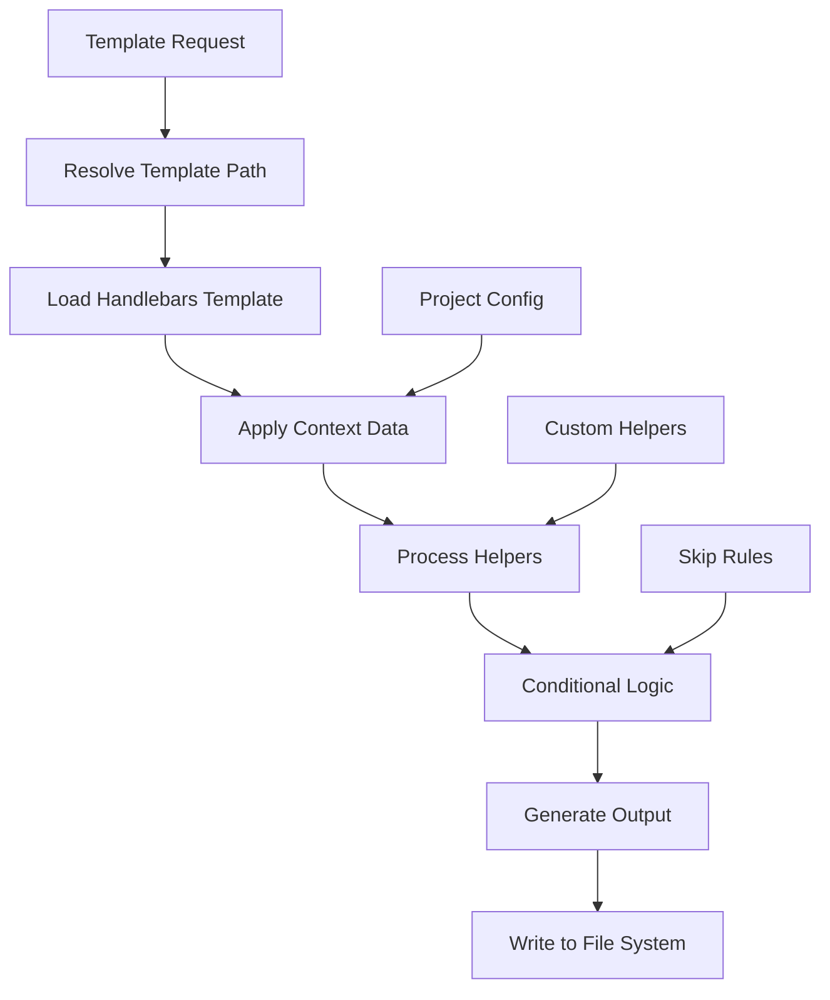

# Template System Documentation

The Precast CLI template system uses Handlebars to generate project files with conditional logic and customization.

## Template Structure

```
src/templates/
├── frameworks/          # Framework-specific templates
│   ├── react/
│   │   ├── base/       # Base project files
│   │   └── src/        # Source code templates
│   ├── vue/
│   ├── angular/
│   └── ...
├── features/           # Feature-specific templates
│   ├── typescript/
│   │   ├── base/      # Base TypeScript config
│   │   ├── react/     # React + TypeScript
│   │   └── vue/       # Vue + TypeScript
│   ├── tailwind/
│   ├── docker/
│   └── ...
└── base/              # Common base templates
    └── common/
```

## Template Processing Flow



## File Naming Conventions

### Template Files

- **`.hbs` extension**: Processed as Handlebars templates
- **No extension**: Copied directly without processing
- **`_filename`**: Becomes `.filename` (for dotfiles like `.gitignore`)

### Examples

```
package.json.hbs        -> package.json (processed)
README.md.hbs          -> README.md (processed)
_gitignore             -> .gitignore (renamed)
_env.example           -> .env.example (renamed)
logo.png               -> logo.png (copied directly)
```

## Handlebars Context

### Project Configuration

All templates receive the complete `ProjectConfig` as context:

```handlebars
{{! Project details }}
Project:
{{name}}
Framework:
{{framework}}
Backend:
{{backend}}
Database:
{{database}}
ORM:
{{orm}}
Styling:
{{styling}}

{{! Boolean flags }}
{{#if typescript}}
  TypeScript is enabled
{{/if}}

{{#if git}}
  Git repository will be initialized
{{/if}}

{{#if docker}}
  Docker configuration included
{{/if}}
```

### Custom Context Variables

Add custom variables by extending the context:

```typescript
const context = {
  ...config,
  customVariable: "custom value",
  computedValue: config.framework === "react" ? "jsx" : "vue",
};

await templateEngine.processTemplate(templatePath, outputPath, context);
```

## Built-in Helpers

### String Manipulation

```handlebars
{{! Capitalize first letter }}
{{capitalize "hello world"}}
{{! -> "Hello world" }}

{{! Convert to kebab-case }}
{{kebabCase "HelloWorld"}}
{{! -> "hello-world" }}

{{! Convert to camelCase }}
{{camelCase "hello-world"}}
{{! -> "helloWorld" }}
```

### Conditional Logic

```handlebars
{{! Equality check }}
{{#eq framework "react"}}
  React-specific content
{{/eq}}

{{! Logical operations }}
{{#and typescript (eq framework "react")}}
  TypeScript React content
{{/and}}

{{#or (eq framework "react") (eq framework "vue")}}
  React or Vue content
{{/or}}

{{#not (eq backend "none")}}
  Backend-specific content
{{/not}}
```

### Array Operations

```handlebars
{{! Check if array includes value }}
{{#includes dependencies "express"}}
  Express is included
{{/includes}}
```

### Advanced Conditionals

```handlebars
{{! Show if ANY condition is true }}
{{#ifAny typescript (eq styling "tailwind") docker}}
  At least one of: TypeScript, Tailwind, or Docker
{{/ifAny}}

{{! Show if ALL conditions are true }}
{{#ifAll typescript (eq framework "react") (eq styling "tailwind")}}
  TypeScript React with Tailwind
{{/ifAll}}
```

## Template Examples

### Package.json Template

```handlebars
{ "name": "{{kebabCase name}}", "version": "0.1.0", "private": true,
{{#if (eq framework "next")}}
  "scripts": { "dev": "next dev", "build": "next build", "start": "next start", "lint": "next lint"
  },
{{else if (eq framework "react")}}
  "scripts": { "dev": "vite", "build": "{{#if typescript}}tsc && {{/if}}vite build", "preview":
  "vite preview" },
{{/if}}
"dependencies": {
{{#eq framework "react"}}
  "react": "^18.2.0", "react-dom": "^18.2.0"{{#if
    (or (includes styling "tailwind") (includes styling "scss"))
  }},{{/if}}
{{/eq}}
{{#eq framework "vue"}}
  "vue": "^3.3.4"{{#if (or (includes styling "tailwind") (includes styling "scss"))}},{{/if}}
{{/eq}}
{{#includes styling "tailwind"}}
  "tailwindcss": "^3.3.0", "autoprefixer": "^10.4.14", "postcss": "^8.4.24"{{#if
    (includes styling "scss")
  }},{{/if}}
{{/includes}}
{{#includes styling "scss"}}
  "sass": "^1.63.6"
{{/includes}}
}, "devDependencies": {
{{#if typescript}}
  "typescript": "^5.0.0",
  {{#eq framework "react"}}
    "@types/react": "^18.2.0", "@types/react-dom": "^18.2.0",
  {{/eq}}
{{/if}}
{{#eq framework "react"}}
  "@vitejs/plugin-react": "^4.0.0", "vite": "^4.4.0"
{{/eq}}
{{#eq framework "vue"}}
  "@vitejs/plugin-vue": "^4.2.0", "vite": "^4.4.0"
{{/eq}}
} }
```

### TypeScript Configuration

```handlebars
{ "compilerOptions": { "target": "ES2020", "useDefineForClassFields": true, "lib": ["ES2020", "DOM",
"DOM.Iterable"], "module": "ESNext", "skipLibCheck": true, /* Bundler mode */ "moduleResolution":
"bundler", "allowImportingTsExtensions": true, "resolveJsonModule": true, "isolatedModules": true,
"noEmit": true,
{{#eq framework "react"}}
  "jsx": "react-jsx",
{{/eq}}
{{#eq framework "vue"}}
  "jsx": "preserve",
{{/eq}}

/* Linting */ "strict": true, "noUnusedLocals": true, "noUnusedParameters": true,
"noFallthroughCasesInSwitch": true }, "include": [ "src"{{#if (eq framework "vue")}}, "*.vue"{{/if}}
], "references": [ { "path": "./tsconfig.node.json" } ] }
```

### Component Templates

React Component:

```handlebars
{{#if typescript}}
import React from 'react';

interface {{capitalize name}}Props {
  // Define props here
}

const {{capitalize name}}: React.FC<{{capitalize name}}Props> = () => {
{{else}}
import React from 'react';

const {{capitalize name}} = () => {
{{/if}}
  return (
    <div>
      <h1>{{capitalize name}} Component</h1>
      {{#if (eq styling "tailwind")}}
      <p className="text-blue-600">
        This is a Tailwind-styled component
      </p>
      {{else}}
      <p>
        This is a basic component
      </p>
      {{/if}}
    </div>
  );
};

export default {{capitalize name}};
```

Vue Component:

```handlebars
<template>
  <div>
    <h1>{{name}} Component</h1>
    {{#if (eq styling "tailwind")}}
      <p class="text-blue-600">
        This is a Tailwind-styled component
      </p>
    {{else}}
      <p>
        This is a basic component
      </p>
    {{/if}}
  </div>
</template>

{{#if typescript}}
  <script setup lang="ts">
    // TypeScript component logic here defineProps<{ // Define props here }>();
  </script>
{{else}}
  <script setup>
    // JavaScript component logic here
  </script>
{{/if}}

{{#if (eq styling "scss")}}
  <style lang="scss" scoped>
// SCSS styles here
</style>
{{else if (ne styling "tailwind")}}
  <style scoped>
    /* CSS styles here */
  </style>
{{/if}}
```

## Conditional File Processing

### Skip Rules

The template engine automatically skips files based on configuration:

```typescript
// In template-engine.ts
private shouldSkipFile(file: string, context: TemplateContext): boolean {
  const fileName = path.basename(file);

  // Skip TypeScript files if not using TypeScript
  if (!context.typescript && (fileName.endsWith(".ts.hbs") || fileName.endsWith(".tsx.hbs"))) {
    return true;
  }

  // Skip JavaScript files if using TypeScript
  if (context.typescript && (fileName.endsWith(".js.hbs") || fileName.endsWith(".jsx.hbs"))) {
    return true;
  }

  // Skip SCSS files if not using SCSS
  if (context.styling !== "scss" && fileName.endsWith(".scss.hbs")) {
    return true;
  }

  // Skip Tailwind config if not using Tailwind
  if (
    (fileName === "tailwind.config.js.hbs" || fileName === "postcss.config.js.hbs") &&
    context.styling !== "tailwind"
  ) {
    return true;
  }

  return false;
}
```

### Conditional Templates

Use conditional template processing for optional features:

```typescript
await templateEngine.processConditionalTemplates(
  [
    {
      condition: config.typescript,
      sourceDir: "features/typescript/base",
    },
    {
      condition: config.styling === "tailwind",
      sourceDir: "features/tailwind",
    },
    {
      condition: config.docker,
      sourceDir: "features/docker",
    },
    {
      condition: (ctx) => ctx.backend !== "none",
      sourceDir: "features/api",
    },
  ],
  projectPath,
  config
);
```

## Creating New Templates

### Framework Template

1. **Create directory structure**:

   ```bash
   mkdir -p src/templates/frameworks/my-framework/{base,src}
   ```

2. **Add base files**:

   ```
   src/templates/frameworks/my-framework/
   ├── base/
   │   ├── package.json.hbs
   │   ├── _gitignore
   │   ├── README.md.hbs
   │   └── index.html.hbs
   └── src/
       ├── main.js.hbs
       ├── main.ts.hbs
       └── App.vue.hbs
   ```

3. **Implement generator**:
   ```typescript
   export async function generateMyFrameworkTemplate(config: ProjectConfig, projectPath: string) {
     const templateEngine = createTemplateEngine(getTemplateRoot());

     await templateEngine.copyTemplateDirectory(
       "frameworks/my-framework/base",
       projectPath,
       config
     );

     await templateEngine.copyTemplateDirectory(
       "frameworks/my-framework/src",
       path.join(projectPath, "src"),
       config
     );
   }
   ```

### Feature Template

1. **Create feature directory**:

   ```bash
   mkdir -p src/templates/features/my-feature/{base,react,vue}
   ```

2. **Add feature files**:

   ```
   src/templates/features/my-feature/
   ├── base/
   │   └── my-feature.config.js.hbs
   ├── react/
   │   └── src/hooks/useMyFeature.ts.hbs
   └── vue/
       └── src/composables/useMyFeature.ts.hbs
   ```

3. **Use in generator**:
   ```typescript
   await templateEngine.processConditionalTemplates(
     [
       {
         condition: config.myFeature,
         sourceDir: "features/my-feature/base",
       },
       {
         condition: config.myFeature && config.framework === "react",
         sourceDir: "features/my-feature/react",
         destDir: ".",
       },
     ],
     projectPath,
     config
   );
   ```

## Custom Helpers

### Registering Helpers

```typescript
templateEngine.registerHelper("myHelper", (input) => {
  // Helper logic
  return processedInput;
});
```

### Helper Examples

```typescript
// Format package name
templateEngine.registerHelper("packageName", (name) => {
  return name.toLowerCase().replace(/\s+/g, "-");
});

// Generate import statement
templateEngine.registerHelper("import", (module, framework) => {
  const imports = {
    react: `import React from '${module}';`,
    vue: `import { createApp } from '${module}';`,
  };
  return imports[framework] || `import '${module}';`;
});

// Conditional class names
templateEngine.registerHelper("classNames", (...classes) => {
  const options = classes.pop();
  return classes.filter(Boolean).join(" ");
});
```

### Using Custom Helpers

```handlebars
{{! Use custom helpers }}
Package:
{{packageName name}}

{{! Import helper }}
{{{import "react" framework}}}

{{! Conditional classes }}
<div class="{{classNames 'base-class' (if typescript 'ts-class') (if tailwind 'tw-class')}}">
  Content
</div>
```

## Template Testing

### Test Structure

```
tests/templates/
├── fixtures/
│   ├── configs/
│   │   ├── react-typescript.json
│   │   └── vue-javascript.json
│   └── expected/
│       ├── react-typescript/
│       └── vue-javascript/
└── template-engine.test.ts
```

### Template Tests

```typescript
import { describe, it, expect } from "bun:test";
import { createTemplateEngine } from "../src/core/template-engine.js";

describe("Template Processing", () => {
  it("should process React TypeScript template", async () => {
    const templateEngine = createTemplateEngine("./tests/fixtures/templates");
    const config = {
      name: "test-project",
      framework: "react",
      typescript: true,
      styling: "tailwind",
      // ... other config
    };

    const result = await templateEngine.processTemplate(
      "./fixtures/package.json.hbs",
      "./output/package.json",
      config
    );

    const content = await fs.readFile("./output/package.json", "utf-8");
    expect(content).toContain('"typescript"');
    expect(content).toContain('"@types/react"');
    expect(content).toContain('"tailwindcss"');
  });
});
```

### Integration Tests

```typescript
describe("Full Template Generation", () => {
  it("should generate complete React project", async () => {
    const config = loadFixture("react-typescript.json");
    const tempDir = await createTempDir();

    await generateReactTemplate(config, tempDir);

    // Verify structure
    expect(await pathExists(path.join(tempDir, "package.json"))).toBe(true);
    expect(await pathExists(path.join(tempDir, "src/App.tsx"))).toBe(true);
    expect(await pathExists(path.join(tempDir, "tsconfig.json"))).toBe(true);

    // Verify content
    const packageJson = await readJson(path.join(tempDir, "package.json"));
    expect(packageJson.dependencies).toHaveProperty("react");
    expect(packageJson.devDependencies).toHaveProperty("typescript");
  });
});
```

## Best Practices

### Template Organization

1. **Group related templates**: Keep framework-specific files together
2. **Use feature directories**: Separate optional features into their own directories
3. **Minimize duplication**: Use base templates for common files
4. **Clear naming**: Use descriptive names for template files

### Template Content

1. **Use meaningful comments**: Explain complex template logic
2. **Handle edge cases**: Account for different configuration combinations
3. **Provide defaults**: Use sensible defaults for optional values
4. **Validate inputs**: Check for required context variables

### Performance

1. **Cache templates**: Reuse compiled templates when possible
2. **Batch operations**: Process multiple files in parallel
3. **Minimize file I/O**: Read templates once and reuse
4. **Skip unnecessary files**: Use skip rules to avoid processing unused files

### Maintenance

1. **Version templates**: Track template changes alongside code changes
2. **Test thoroughly**: Write tests for different configuration combinations
3. **Document changes**: Update documentation when adding new templates
4. **Monitor usage**: Track which templates are used most frequently
